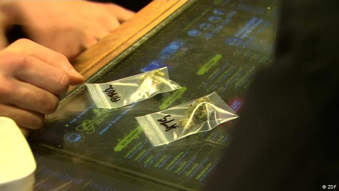

# Experta: el cannabis puede alterar la química cerebral de forma permanente

La Dra. Yasmin Hurd, neurocientífica del Hospital Monte Sinaí de Nueva York, dijo en una conferencia en Harvard que los consumidores de cannabis están subestimando sus posibles efectos a largo plazo.

El consumo de cannabis se ha convertido en un pilar en la vida de muchos jóvenes, pero una experta advierte que dicha droga podría conllevar más riesgos de los que se creen.

A finales del mes de abril, en el coloquio "día de la hierba" en Estados Unidos, el 20 de abril, o 4/20, la Dra. Yasmin Hurd, una de las principales neurocientíficas del Hospital Monte Sinaí de Nueva York, advirtió que muchos consumidores jóvenes pueden estar subestimando los posibles efectos a largo plazo de la droga.

Advierte que el "subidón" producido por la droga altera la química cerebral de una persona y podría incluso ponerla en riesgo de desarrollar graves problemas psiquiátricos más adelante.

##### Un cóctel de sustancias

El cannabis contiene más de 500 sustancias químicas, entre ellas más de 140 cannabinoides que tienen un mayor o menor grado de actividad "psicofarmacológica", explicó Hurd en una conferencia de neurociencia en Harvard.

Explicó que los cannabinoides del tetrahidrocannabinol, o THC como se le suele conocer, la sustancia química de la droga que provoca los efectos de alteración, interactúa con los endocannabinoides en el cerebro.

Estos endocannabinoides son responsables de determinar la forma en que las células del cerebro interactúan entre sí.

De tal forma que los cannabinoides del THC interactúan con los receptores que configuran esas interacciones y los alteran, lo que crea la sensación que tiene la gente cuando consume la droga.

"Si la sensación es de embriaguez, significa que se está uniendo a un receptor y cambiando tu cerebro. La pregunta es durante cuánto tiempo, y si aumenta el riesgo de sufrir trastornos psiquiátricos", se preguntó.

Aunque se considera que el cannabis no es tan dañino ni tiene las propiedades adictivas de otras drogas, como la cocaína, la heroína o incluso el alcohol, existen peligros potenciales por su consumo frecuente que los expertos aún no han descubierto.

"Si fuera benigna, nadie la usaría", señaló Hurd, explicando que la prevalencia de la droga demuestra que tiene algún tipo de efecto en la química cerebral de una persona.

Señala que alrededor del 30 por ciento de las personas que consumen regularmente la droga tienen también un trastorno psiquiátrico.

##### Algunos puntos inciertos

Uno de los problemas para los investigadores es que no pueden saber si la droga está causando los problemas psiquiátricos, o si las personas que ya sufren este tipo de problemas son más propensas a recurrir a la droga para lidiar con el estrés de la misma.

Otro problema conocido es el uso de la droga entre las mujeres embarazadas, que a menudo dañan el desarrollo del cerebro de su feto.

La legalización sigue ganando terreno
El consumo de cannabis es legal de alguna manera en todos los estados de EE. UU. excepto en seis. En 18 estados, es totalmente legal tanto a nivel médico como recreativo.

La legalización de la marihuana cuenta con un fuerte apoyo en EE. UU., ya que una reciente encuesta de la CBS reveló que dos tercios de los estadounidenses la apoyan tanto a nivel estatal como federal.

La legalización cuenta con un apoyo abrumador de los demócratas (79%) y de los independientes (67%), mientras que incluso la mitad de los republicanos también la apoyan.

Una encuesta de Gallup del verano pasado reveló que la mitad de los estadounidenses adultos han probado la marihuana al menos una vez, un récord.